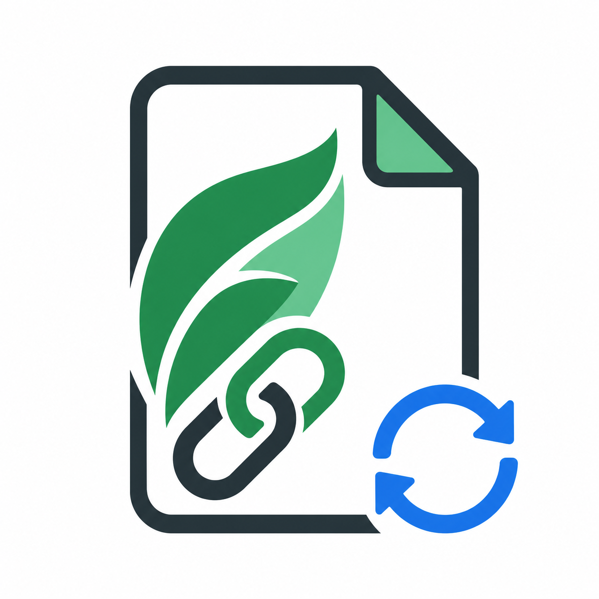

# Overleaf LeafLink Sync

<p align="center">
  
</p>

<p align="center">
  A Codex skill and helper workflow for syncing local LaTeX projects to Overleaf through LeafLink.
</p>

Overleaf LeafLink Sync wraps a practical Overleaf workflow for people who do not want to rely on Overleaf's paid Git bridge or manual zip uploads. It keeps your repository as the source of truth, packages only the Overleaf-safe LaTeX sources, and uses [LeafLink](https://github.com/xiongqi123123/LeafLink) for browser-authenticated push/pull against an Overleaf project.

## What It Does

- Provides a Codex skill for Overleaf synchronization tasks.
- Uses a dedicated non-`base` conda environment.
- Runs the repository's `make overleaf-package` target before syncing.
- Copies only packaged LaTeX sources into a dedicated LeafLink workspace.
- Runs `leaflink status` and `leaflink push --dry-run` before real pushes.
- Preserves `PLAYWRIGHT_BROWSERS_PATH` for systems where Playwright installs browsers outside the default home cache.

## Repository Layout

```text
.
├── SKILL.md
├── agents/openai.yaml
├── assets/
│   ├── logo.png
│   └── logo.svg
└── scripts/
    └── leaflink_overleaf_sync.py
```

## Install as a Codex Skill

Clone this repository into your Codex skills directory:

```bash
mkdir -p "${CODEX_HOME:-$HOME/.codex}/skills"
git clone https://github.com/muqy1818/overleaf-leaflink-sync.git \
  "${CODEX_HOME:-$HOME/.codex}/skills/overleaf-leaflink-sync"
```

Then start a new Codex session and ask:

```text
Use $overleaf-leaflink-sync to sync this LaTeX project to Overleaf.
```

## Environment Setup

Create a dedicated environment. Do not install into conda `base`.

```bash
conda create -n leaflink-sync python=3.11
conda activate leaflink-sync
pip install "leaflink[browser,watch]"
playwright install chromium
```

If your network needs a proxy:

```bash
export https_proxy=http://127.0.0.1:7890
export http_proxy=http://127.0.0.1:7890
export all_proxy=socks5://127.0.0.1:7890
playwright install chromium
```

If Playwright installs browsers under a non-default cache path, set:

```bash
export PLAYWRIGHT_BROWSERS_PATH=/mnt/data/.cache/ms-playwright
```

## First Sync

Login and clone the Overleaf project into a dedicated sync directory:

```bash
leaflink login --base-url https://www.overleaf.com
leaflink clone https://www.overleaf.com/project/<project-id> output/overleaf_leaflink
```

Package the local LaTeX project, copy the packaged source, and dry-run the push:

```bash
python scripts/leaflink_overleaf_sync.py sync \
  --package-repo /path/to/latex-repo \
  --sync-dir /path/to/latex-repo/output/overleaf_leaflink \
  --dry-run
```

If the dry run looks correct, push:

```bash
python scripts/leaflink_overleaf_sync.py sync \
  --package-repo /path/to/latex-repo \
  --sync-dir /path/to/latex-repo/output/overleaf_leaflink
```

## Safety Model

This workflow deliberately avoids syncing the full repository root. Keep generated artifacts, reference PDFs, experiment outputs, `.git`, and private project files outside the LeafLink sync directory. The expected source of truth is:

```text
repo root -> make overleaf-package -> output/overleaf_src -> LeafLink workspace -> Overleaf
```

Always inspect `leaflink status` and `leaflink push --dry-run` before a real push.

## Requirements

- Python 3.10+
- LeafLink
- Playwright Chromium
- `rsync`
- A LaTeX project with a clean packaging target such as `make overleaf-package`

## Relationship to LeafLink

This project does not replace LeafLink. It is a thin Codex skill and workflow wrapper around LeafLink for repeatable manuscript syncing.

## License

Apache-2.0
